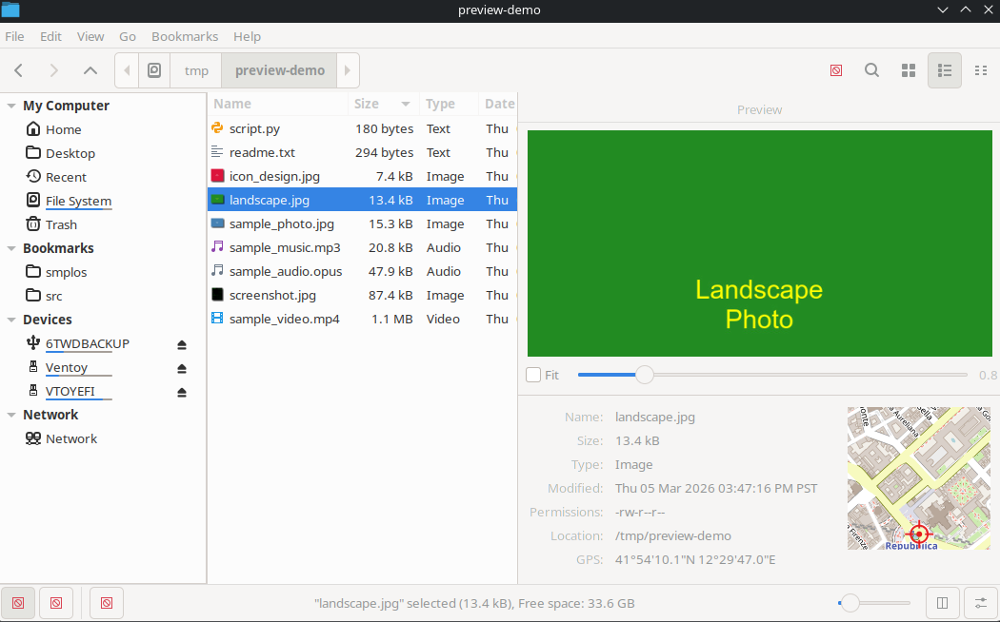

Nemo
====
Nemo is a free and open-source software and official file manager of the Cinnamon desktop environment. 
It is a fork of GNOME Files (formerly named Nautilus).

Nemo also manages the Cinnamon desktop.
Since Cinnamon 6.0 (Mint 21.3), users can enhance their own Nemo with Spices named Actions.

History
====
Nemo started as a fork of the GNOME file manager Nautilus v3.4. Version 1.0.0 was released in July 2012 along with version 1.6 of Cinnamon,
reaching version 1.1.2 in November 2012.

Developer Gwendal Le Bihan named the project "nemo" after Jules Verne's famous character Captain Nemo, who is the captain of the Nautilus.

Features
====
Nemo v1.0.0 had the following features as described by the developers:
1. Ability to SSH into remote servers
2. Native support for FTP (File Transfer Protocol) and MTP (Media Transfer Protocol)
3. All the features Nautilus 3.4 had and which are missing in Nautilus 3.6 (all desktop icons, compact view, etc.)
4. Open in terminal (integral part of Nemo)
5. Open as root (integral part of Nemo)
6. Uses GVfs and GIO
7. File operations progress information (when copying or moving files, one can see the percentage and information about the operation on the window title and so also in the window list)
8. Proper GTK bookmarks management
9. Full navigation options (back, forward, up, refresh)
10. Ability to toggle between the path entry and the path breadcrumb widgets
11. Many more configuration options

Preview Pane
====

The Preview Pane provides a live file preview and metadata panel directly inside the file manager window. Toggle it with **Alt+F3** or the button in the status bar.

### GPS Map Preview

When viewing an image that contains GPS coordinates in its EXIF data, the Preview Pane displays a **150×150 map tile** from [OpenStreetMap](https://www.openstreetmap.org) alongside the file metadata. A crosshair marker indicates the exact location where the photo was taken.

- **Click the map** to open the location in your default browser on OpenStreetMap
- Tiles are **cached locally** in `~/.cache/nemo/map-tiles/` for instant subsequent loads
- Works fully **offline-safe** — if there is no internet connection, the map simply does not appear; no errors or UI disruption
- No API keys or external dependencies required — uses only libraries already bundled with Nemo (GIO, GdkPixbuf, Cairo, libexif)

### Keyboard Shortcuts

| Shortcut | Action |
|----------|--------|
| **Alt+F3** | Toggle the Preview Pane on/off |
| **Shift+Alt+F3** | Toggle the metadata/details panel within the Preview Pane |
| **Ctrl+[** | Grow the Preview Pane (wider) |
| **Ctrl+]** | Shrink the Preview Pane (narrower) |

---

smpl-nemo Additions
====

This fork ([KonTy/nemo](https://github.com/KonTy/nemo)) extends upstream Nemo with the following features:

### Overview Page — Disk Usage Visualisation

A new **Overview** entry sits at the top of the sidebar under *My Computer*. It provides a full disk-usage dashboard without leaving the file manager.

- **Donut charts** — one per mounted volume, showing used vs. free space with percentage label
- **Deep top-offenders scan** — a full recursive `du`-style scan (equivalent to `du -a | sort -nr | head`) runs automatically in the background as soon as Nemo starts, so the chart is ready the moment you open Overview
- **Bar chart** — horizontal bar per offender, scaled to the largest item, with a hover tooltip showing the full path and human-readable size
- **Ranked list** — scrollable list of the top disk hogs beneath each bar chart; click any row to navigate directly to that directory
- **Process-wide cache** — scan results are shared across all windows and tabs; revisiting Overview is instant
- **Periodic rescan** — the cache refreshes automatically every 120 seconds in the background
- **Sidebar selection** — the Overview row in the sidebar is highlighted correctly when Overview is active, and cleared when navigating away
- **Full navigation integration** — back/forward buttons, sidebar clicks, and address-bar entries all work correctly with `overview://`; pressing Back from a directory returns to Overview without errors

### Preview Pane

An embedded preview panel toggled with **Alt+F3** that shows a live file preview and metadata directly inside the window.

- GPS map tile (OpenStreetMap) for geotagged images, with a crosshair at the shot location; click to open in browser
- Map tiles cached locally in `~/.cache/nemo/map-tiles/`
- Adjustable pane width with **Ctrl+[** / **Ctrl+]**

### Other Additions

| Feature | Description |
|---------|-------------|
| **Copy Path** | *Copy Path* entry in the right-click context menu |
| **Tab to switch panes** | Press **Tab** to move focus between left and right split panes |
| **Anywhere search** | Interactive filename search matches characters anywhere in the name, not just at the start |
| **Sidebar context menus** | Right-click context menus on sidebar items; **Insert** / **F4** keybindings |
| **Configurable shortcuts** | Keyboard shortcuts editable via preferences |
| **Memory leak fixes** | Several memory leaks in the original codebase corrected |